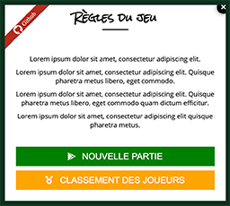

[Retourner au sommaire](https://github.com/wmalbos/wmalbos/blob/main/README.md)

# Jeu de mémoire

== Voir la [démo en ligne](https://games.wmalbos.fr/memory) ==

**Objectifs du projet :** _L'objectif du projet est de développer un jeu de société au format numérique._ 

_Le projet pourrait alors être confié en guise d'exemple, à des étudiants pour leur montrer un code de base, pour développer leurs propres mini-jeux (tetris, puissance 4, bataille navale, ...) en utilisant uniquement les bases de la programmation, sans utiliser de framework ni de design pattern spécifiques._

### I) Présentation du jeu

Initialement, le jeu "Memory" (ou "Jeu de mémoire" en français) est un jeu de société édité par le groupe Ravensburger, sortie en 1959.

Dans cette version numérique à 1 joueur, le jeu se compose d'un certain nombre de paires de cartes portant des illustrations identiques. Les cartes sont mélangées, puis retournées face contre table.

Le joueur doit retourner deux cartes, si elles ne sont pas identiques, elles sont de nouveau retournées face contre table à leur emplacement d'origine. Le jeu se termine avec une victoire quand toutes les paires de cartes ont été découvertes ou une défaite lorsque le compte à rebours du jeu est arrivé à son terme. 

En savoir plus sur [wikipédia](https://fr.wikipedia.org/wiki/Memory_(jeu))

### II) Propositions de variantes et améliorations

Il est possible de modifier l'expérience de jeu en modifiant quelques règles : 

- on rajoute du temps à chaque fois qu'une paire de cartes identiques a été découverte, pour simplifier le jeu.
- un mode "multijoueur" où le joueur qui découvre le plus grand nombre de pair de carte identique l'emporte, par exemple.
- sauvegarde des différents scores pour créer du challenge, avec un système de difficulté
- on rajoute une couleur unique aux illustrations pour augmenter la difficulté et perturber le joueur, il faut alors découvrir une paire de cartes de même illustration et de même couleur, on peut également jouer sur d'autres paramètres comme la taille, le sens, etc...
- compter les nombres de coups, les nombres de parties, les nombres d'échecs, etc...
- ajout d'une musique d'ambiance et de sons ( menu, découverte d'une paire, victoire, échec, ... )
- ajout d'un système de pause / reprise lorsque l'on ouvre le menu pour ne pas perdre la partie en cours
- et pleins d'autres possibilités en fonction de notre imagination

### III) Choix techniques

#### a) Programmation Orienté Objets
##### 1) Le jeu

La structure du jeu suit la forme suivante : 
- Classe "Jeu"
- Classe "Plateau"
- Classe "Carte"

Cette structure générique, est très modulaire, on peut l'utiliser pour inclure une multitude de fonctionnalités, simplement, telle qu'un mode multijoueur en ayant 2 plateaux en même temps sur un jeu par exemple. 

On peut également l'utiliser dans d'autres jeux, comme un Tetris. 
- Jeu = Tetris
- Plateau = Grille de jeu
- Carte = Tetrominos (ce sont les pions aux diverses formes du jeu)

ou alors une bataille navale
- Jeu = Bataille Navale
- Plateau = Grille de combat
- Carte = Bateau

Des classes annexes sont utilisées, et réutilisables, comme le Countdown qui gère un décompte de temps (avec des méthodes comme start, stop, pause, resume) 

##### 2) Persistance des données
La classe Database permet de gérer, notamment, la connexion à la base de données à l'aide d'un fichier de configuration. 
La classe Statistics permet, quant à elle, de gérer le modèle Statistic mais également les requêtes en base de données sur cette table. 

Il est possible, d'améliorer la structure en évoluant vers une structure [Modèle-Vue-Controlleur](https://fr.wikipedia.org/wiki/Mod%C3%A8le-vue-contr%C3%B4leur).

#### b) Graphisme et effets audio
Des graphismes simples (images, :before, :after, ..) et quelques effets audio (victoire, échec, ...) ont été ajoutés. L'objectif est de motiver l'étudiant, en réalisant son propre mini-prototype fonctionnel. On peut lui fournir un code de base pour l'aider à démarrer, si besoin.

#### c) Fichier de configuration
Le fichier de configuration est utilisé pour configurer la base de données et séparer la logique du code. En l'incluant dans le .gitignore on peut également en avoir une configuration différente en local et sur le serveur de production.

#### d) Makefile
Le projet comporte un fichier Makefile qui permet de réaliser certaines actions rapidement en utilisant un IDE ([Environnement de développement](https://fr.wikipedia.org/wiki/Environnement_de_d%C3%A9veloppement)). 

Sans IDE, il reste possible d'utiliser le makefile en utilisant les commandes suivantes : 

- **make composer_install** -- (Cette commande permet d'installer les dépendances de composer)
- **make composer_update** -- (Cette commande permet de mettre à jour les dépendances)
- **make sass_dev** -- (Cette commande permet de compiler de manière automatique les assets du projet)
- **make sass_production** -- (Cette commande permet de compiler les assets du projet pour la production et de les minifier pour améliorer les performances)

#### e) Outils de déploiement

(Le guide d'installation et d'utilisation de docker est disponible sur la branche nommée "docker")

### IV) Prévisualisations

