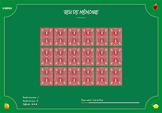

[Retourner au sommaire](https://github.com/wmalbos/wmalbos/blob/main/README.md)

# Jeu de mémoire

== Voir la [démo en ligne](https://games.wmalbos.fr/memory) ==

**Objectifs du projet :** Texte en rédaction...

### I) Présentation du jeu

Initialement, le jeu "Mémory" ( ou "Jeu de mémoire" en français ) est un jeu de société édité par le groupe Ravensburger, sortie en 1959.

Dans cette version numérique à 1 joueur, le jeu se compose d'un certain nombre de paires de cartes portant des illustrations identiques. Les cartes est mélangées, puis retournées face contre table.

Le joueur dois retourner deux cartes, si elles ne sont pas identiques, elle sont de nouveau retournées face contre table à leur emplacement de départ. Le jeu ce termine avec une victoire quand toutes les paires de cartes ont été découvertes ou une défaite lorsque le compte à rebours du jeu est arrivé à son terme. 

### II) Propositions de variantes et améliorations

Il est possible de modifier l'expérience de jeu en modifiant quelques règles : 

- On rajoute du temps à chaque fois qu'une paire de carte identique à été découverte.
- Mode "multijoueurs" où le joueur qui découvre le plus grand nombre de pair de carte identique l'emporte.
- Sauvegarde des différents score pour créer du challenge.
- On rajoute une couleur unique aux illustrations pour augmenter la difficulté et perturber le joueur, il faut alors découvrire une paire de carte de même illustration et de même couleur.
- Compter les nombres de coups, les nombre de parties, etc...
- Ajout d'une musique d'ambiances et de sons ( découvrte d'une paire, victoire, echec, ... )

### III) Choix techniques

#### a) Programmation Orienté Objets
##### 1) Le jeu
Texte en rédaction...
##### 2) Persistance des données
Texte en rédaction...

#### b) Graphisme et effets audio
Texte en rédaction...

#### c) Fichier de configuration
Texte en rédaction...

#### d) Makefile
Le projet comporte un fichier **Makefile** qui permet de réaliser certaines actions rapidement en utilisant un IDE (Environnement De Développement), comme par exemple PhpStorm. 

Sans IDE, il reste possible d'utiliser le makefile en utilisant les commandes suivantes : 

- **make composer_install** -- ( Cette commande permet d'installer les dépendances de composer )
- **make composer_update** -- ( Cette commande permet de mettre à jours les dépendances)
- **make sass_dev** -- ( Cette commande permet de compiler de manière automatique les assets du projet )
- **make sass_production** -- ( Cette commande permet de compiler les assets du projet pour la production et de les minifier pour améliorer les performances )

### IV) Prévisualisations

